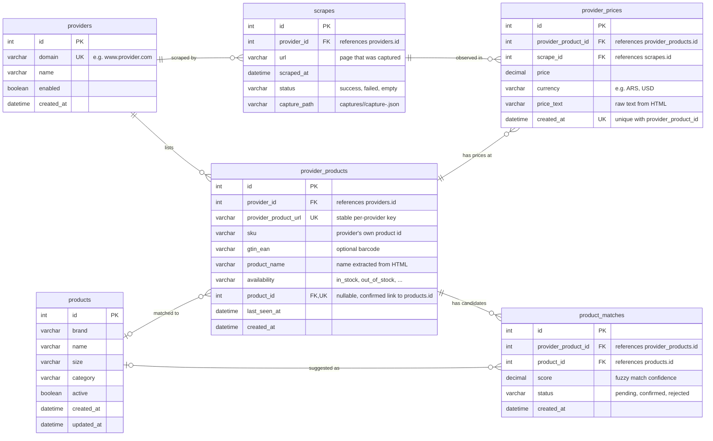

# Database

## ER Diagram

## Tables

### providers

| Column     | Type    | Notes |
| ---------- | ------- | ----- |
| id         | int     | primary key |
| domain     | varchar | unique, e.g. `www.provider.com` |
| name       | varchar | display name |
| enabled    | boolean | whether this provider is being scraped |
| created_at | datetime | |

### products

Canonical, known products.

| Column     | Type     | Notes |
| ---------- | -------- | ----- |
| id         | int      | primary key |
| brand      | varchar  | |
| name       | varchar  | |
| size       | varchar  | |
| category   | varchar  | optional; improves fuzzy matching |
| active     | boolean  | `false` when retired; not eligible for new matches |
| created_at | datetime | |
| updated_at | datetime | when the row was last edited |

### scrapes

One poll of a provider page (one `capture-<timestamp>.json` file).

| Column        | Type     | Notes |
| ------------- | -------- | ----- |
| id            | int      | primary key |
| provider_id   | int      | foreign key → `providers.id` |
| url           | varchar  | page that was captured |
| scraped_at    | datetime | when the poll happened |
| status        | varchar  | `success`, `failed`, `empty` |
| capture_path  | varchar  | `captures/<domain>/capture-<ts>.json` |

### provider_products

A product as listed on a specific provider's site. `product_name` is extracted from the HTML; the confirmed mapping to a canonical `products` row lives in `product_id`, with candidate/recommended matches in `product_matches`.

| Column                | Type     | Notes |
| --------------------- | -------- | ----- |
| id                    | int      | primary key |
| provider_id           | int      | foreign key → `providers.id` |
| provider_product_url  | varchar  | unique per provider; stable key for idempotent upserts |
| sku                   | varchar  | provider's own product id, when present |
| gtin_ean              | varchar  | optional barcode, when present |
| product_name          | varchar  | name extracted from HTML |
| availability          | varchar  | e.g. `in_stock`, `out_of_stock` |
| product_id            | int      | nullable; confirmed foreign key → `products.id` |
| last_seen_at          | datetime | last poll that observed this listing |
| created_at            | datetime | |

Unique: `(provider_id, provider_product_url)`. For matched rows, `product_id` is unique per provider product.

### product_matches

Fuzzy-match results between a provider product and canonical products. Stores the top candidates and their status so recommendations are separate from human-confirmed decisions.

| Column              | Type     | Notes |
| ------------------- | -------- | ----- |
| id                  | int      | primary key |
| provider_product_id | int      | foreign key → `provider_products.id` |
| product_id          | int      | foreign key → `products.id` |
| score               | decimal  | fuzzy match confidence (0–1) |
| status              | varchar  | `pending`, `confirmed`, `rejected` |
| created_at          | datetime | |

When a match is confirmed, `provider_products.product_id` is set to the same `products.id`.

### provider_prices

Price observations for a provider product over time.

| Column              | Type      | Notes |
| ------------------- | --------- | ----- |
| id                  | int       | primary key |
| provider_product_id | int       | foreign key → `provider_products.id` |
| scrape_id           | int       | foreign key → `scrapes.id`; which poll observed this |
| price               | decimal   | parsed numeric price |
| currency            | varchar   | e.g. `ARS`, `USD` |
| price_text          | varchar   | raw text from HTML, for auditing |
| created_at          | datetime  | |

Unique: `(provider_product_id, created_at)` guards against duplicate snapshots within one poll.

## Implementation notes

The app persists through the PocketBase Record API only (no SQL, no direct DB file access). PocketBase collections do **not** enforce foreign keys or composite unique constraints:

- All `FK` markers above are logical references, enforced in application code.
- Dedup on `(provider_id, provider_product_url)` must be handled in app code (e.g. lookup-then-upsert on `provider_product_url`).
- The `(provider_product_id, created_at)` guard on `provider_prices` is applied in app code before inserting.
- If a future migration moves this model to a relational SQL database (Diesel/SQLx), these constraints become enforceable schema-level `FOREIGN KEY` / `UNIQUE` clauses.
